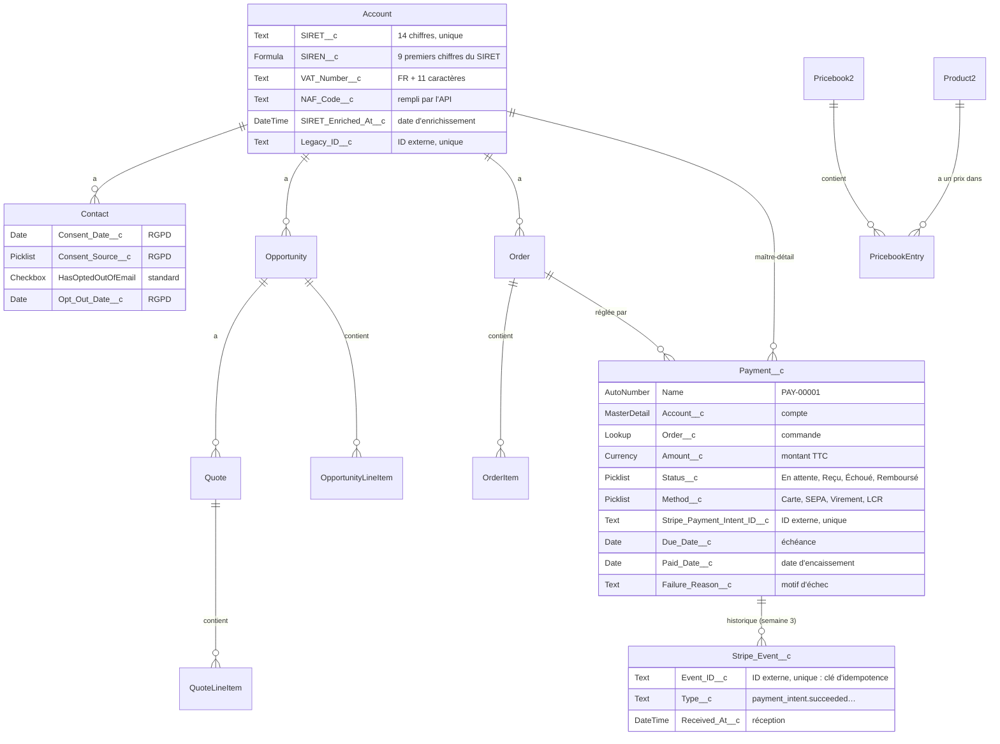

# Modèle de données / Data model

*Version 1.0 · 1er octobre 2026 · Décisions détaillées dans le [journal des décisions](05-decision-log.md)*

## Schéma



> Une capture du Schema Builder sera ajoutée dans `docs/img/data-model.png` pour le post LinkedIn.

## Objets

| Objet | Standard / custom | Rôle | Partage (OWD) |
|---|---|---|---|
| Account | Standard | Client (personne morale) | **Privé** |
| Contact | Standard | Interlocuteur chez le client | Contrôlé par le parent |
| Opportunity | Standard | Affaire en cours | **Privé** |
| Product2, Pricebook2 | Standard | Catalogue et prix en euros | Lecture publique |
| Quote, QuoteLineItem | Standard | Devis envoyé au client (activé en semaine 2) | Contrôlé par le parent |
| Order, OrderItem | Standard | Commande créée quand l'affaire est gagnée | Contrôlé par le parent |
| **Payment__c** | Custom | Un paiement attendu ou reçu pour une commande | Contrôlé par le parent (Account) |
| **Stripe_Event__c** | Custom | Journal des webhooks Stripe reçus (semaine 3) | Privé, finance uniquement |

## Champs personnalisés

### Account

| Libellé | API | Type | Règle |
|---|---|---|---|
| SIRET | `SIRET__c` | Texte (14), unique | Exactement 14 chiffres (règle de validation). Obligatoire à la création, sauf pour la migration. |
| SIREN | `SIREN__c` | Formule (texte) | `LEFT(SIRET__c, 9)` |
| N° TVA intracommunautaire | `VAT_Number__c` | Texte (13) | Format `FR` + 2 caractères + 9 chiffres ; les 9 derniers chiffres doivent être égaux au SIREN. |
| Code NAF | `NAF_Code__c` | Texte (6) | Rempli par l'API Recherche d'entreprises. |
| Enrichi le | `SIRET_Enriched_At__c` | Date/heure | Rempli par l'API. |
| ID historique | `Legacy_ID__c` | Texte (20), ID externe, unique | Clé de migration ; permet de recharger sans doublon. |

### Contact (RGPD)

| Libellé | API | Type |
|---|---|---|
| Date du consentement | `Consent_Date__c` | Date |
| Source du consentement | `Consent_Source__c` | Liste : Salon, Site web, Formulaire papier, Email, Téléphone |
| Refus des emails | `HasOptedOutOfEmail` | Case à cocher (standard) |
| Date du refus | `Opt_Out_Date__c` | Date |

### Payment__c

| Libellé | API | Type | Remarque |
|---|---|---|---|
| N° paiement | `Name` | Numéro automatique `PAY-{00000}` | |
| Compte | `Account__c` | Maître-détail (Account) | Hérite du partage du compte |
| Commande | `Order__c` | Référence (Order) | |
| Montant | `Amount__c` | Devise (16, 2) | TTC, en euros |
| Statut | `Status__c` | Liste : `Pending`, `Succeeded`, `Failed`, `Refunded` | Libellés en français ; valeurs API en anglais, alignées sur Stripe |
| Moyen de paiement | `Method__c` | Liste : `Card`, `SEPA_Debit`, `Bank_Transfer`, `LCR` | |
| ID PaymentIntent Stripe | `Stripe_Payment_Intent_ID__c` | Texte (255), ID externe, unique | Lien avec Stripe |
| Échéance | `Due_Date__c` | Date | |
| Encaissé le | `Paid_Date__c` | Date | |
| Délai de paiement (jours) | `Days_To_Payment__c` | Formule (nombre) | `Paid_Date__c - Order__r.EffectiveDate` |
| Motif d'échec | `Failure_Reason__c` | Texte (255) | |

## Rôles

```
Direction générale
├── Directeur commercial
│   └── Commercial
└── Finance
```

Les commerciaux ne voient que leurs comptes. Le directeur commercial voit ceux de son équipe grâce à la hiérarchie. La finance voit tous les comptes en lecture grâce à une règle de partage.
